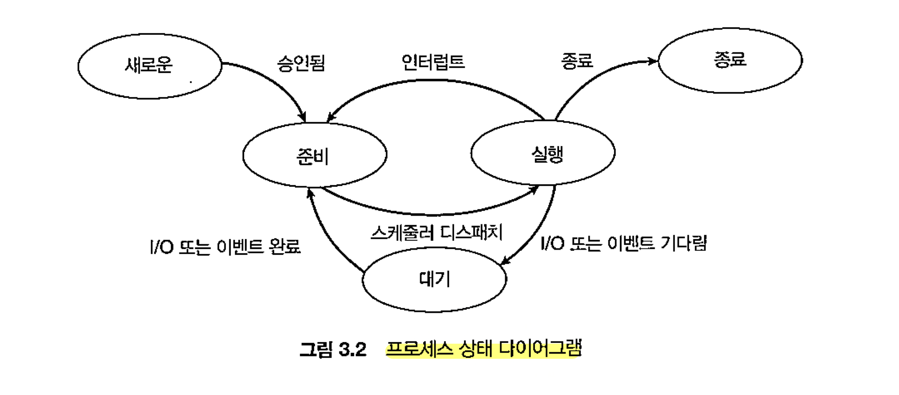
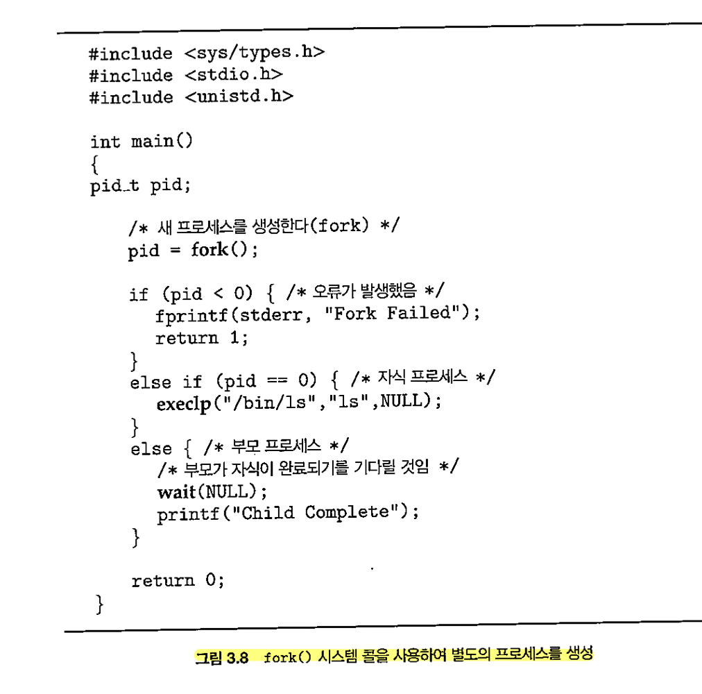
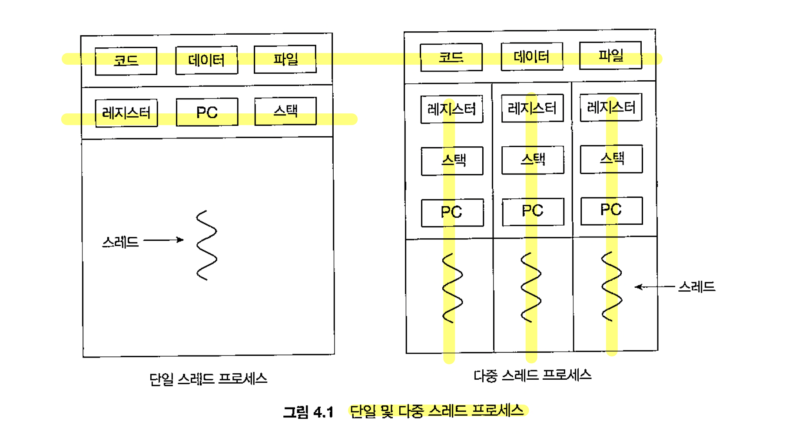

## ch 3 프로세스

key point

1. 프로세스 생명 주기
2. 프로세스 간 통신
3. 소켓과 rpc

### 1. 프로세스

1) 정의

실행 중인 프로그램(비공식)

프로그램: 수동적 passive

프로세스: 능동적 active, 프로세스 자체가 다른 개체를 위한 실행 환경이 될 수 있음

프로세그의 메모리 배치

스택 : 함수 매개 변수, 복귀 주소, 지역 변수 -> 활성화 레코드

힙 : 동적 메모리

데이터 : 전역 변수

텍스트 : 실행 코드

데이터와 텍스트는 고정 된 크기

2) 상태

3) 제어

pcb : 프로세스 제어 블록

상태 : 프로세스의 상태 (ready, run, etc..)

카운터 : 다음에 실행 할 명령어 주소

레지스터 : cpu 레지스터 정보

cpu 스케줄링 정보 : 프로세스 우선 순위, 스케줄 큐에 대한 포인터와 다른 스케줄 매개 변수

메모리 관리 정보 : base, limit 정보, page, segment table 정보

accounting 정보 : cpu 사용 시간, 경과 시간, 시간 제한, 계정 번호, job | process 아이디

입출력 상태 정보 : process에 할당 된 입출력 장치, 열린 파일 목록

### 2. 쓰레드

프로세스 모델은 사실 단일 실행 쓰레드를 가정 한 것

그러나 현대 프로세스는 다중 쓰레드!

이런 시스템에서 pcb는 쓰레드에 관한 정보 포함

### 3. 프로세스 스케줄링

프로세스에는 io바운드, cpu바운드 2가지 성격의 유형이 존재

따라서 이를 적절하게 처리하기 위해 스케줄링이 필요하다

### 4. cpu 스케줄링

준비 큐에 있는 프로세스에 cpu 할당

스왑하기도 함, swap-in swap-out

### 5. 문맥 교환

문맥은 프로세스의 pcb에 기록

커널 모드건 사용자 모드건 cpu의 현재 상태를 저장 복구 해야한다

### 6. 프로세스 연산

프로세스들은 병행 실행 가능

1) 생성

부모 프로세스가 자식 프로세스를 생성한다 -> 트리 구조

프로세스는 자원이 필요 한데, OS에게 이를 얻거나 부모의 자원 일부를 사용한다

부모는 자신의 자원을 자식과 공유하거나 분할해서 줄 수 있다

2가지 실행 법

(1) 부모 자식 병행 실행

(2) 부모는 자식이 종료 될 때 까지 wait

주소 공간 측면에서는 2가지

(1) 자식은 부모의 복사본, copy

(2) 자식이 새로운 프로그램 갖고 있음, exec

2) 종료

종료되었지만 부모가 아직 wait 호출 안하면 좀비가 된다

사실 모든 프로세스는 잠깐 좀비가 된다

부모가 wait 호출 안하고 종료한다면 고아가 된다

### 7. ipc

둘 다 커널의 도움이 필요하긴 하다

1) 공유 메모리

프로세스들이 공유 메모리를 구축한다

데이터의 형식, 위치를 프로세스들 사이에서 정해야한다 + 동기화

가장 일반적인 유형은 생산자-소비자 모델이다

여기에는 아래와 같은 2가지 버퍼가 존재한다

(1) 무한 버퍼, unbounded : 생산 소비 기다릴 필요 없다

(2) 유한 버퍼 bounded : 가득차거나 비어있으면 대기

2) 메세지

2가지 연산이 있다, send receive

프로세스 P, Q 사이에 통신을 하려면 communication link가 설정 되어야 한다

주요 특성 3가지

1. in/direct 통신
2. a/sync 통신
3. 자동/명시 버퍼링

2-1) 명명, naming

직접 통신 : 수신 송신 프로세스의 이름을 명시

간접 통신 : 메일 박스 | 포트

2-2) 동기, sync

메세지 전달은 block/none-block 가능(동기 비동기)

2-3) 버퍼

유한버퍼와 무한 버퍼가 존재

### 8. 클라이언트-서버 모델

1) 소켓

각 소켓은 ip주소와 포트 번호가 있다

스레드간에 구조화되지 않은 바이트 스트림 통신

2) rpc

전달되는 메세지는 구조화되어 있다

## ch 4 쓰레드

스레드란

cpu를 사용하는 기본 단위, 쓰레드 아이디, pc, 레지스터, 스택으로 구성

기존 프로세스와 동일한 작업을 하는 프로세스를 새로 생성하는 것 보다는 쓰레드를 생성하는 비용이 더 저렴하다

* 암달의 법칙

다중 코어 시스템 프로그래밍의 5가지 과제

1. 테스크 인식
2. 균형
3. 데이터 분리
4. 데이터 종속
5. 시험 및 디버깅

1) 병렬 실행의 2가지 유형

1. 데이터 병렬 : 데이터 기준 병렬 실행
2. 테스크 병렬 : 테스크(쓰레드) 기준 병렬 실행