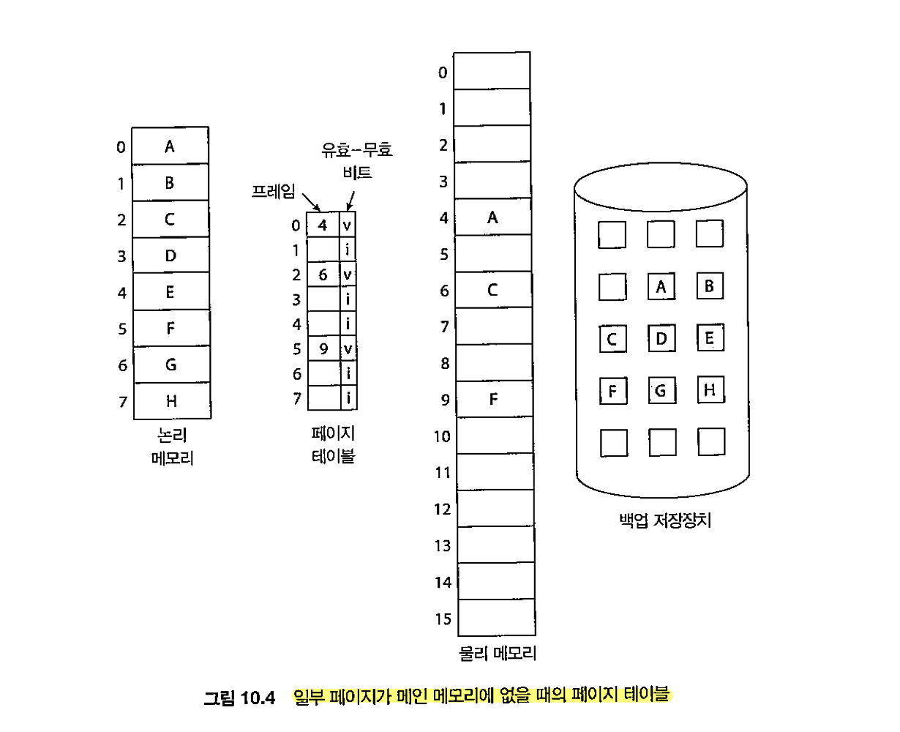
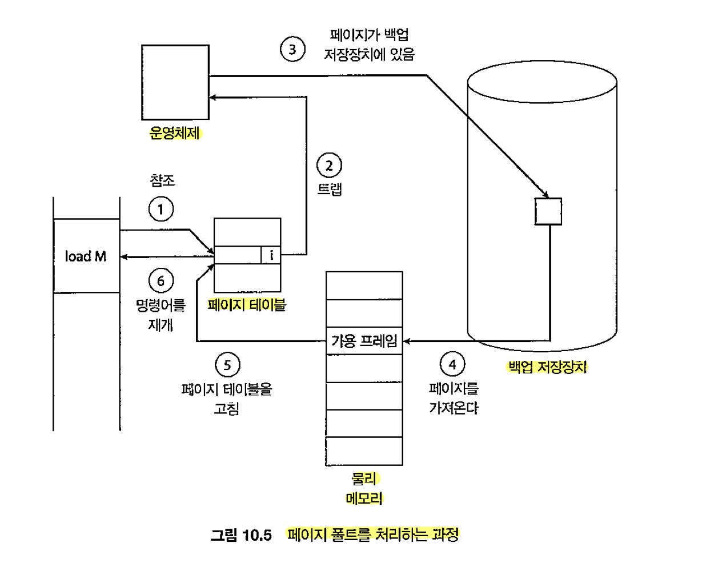

# ch 9

### 주소 바인딩

한 주소 공간에서 다른 주소 공간으로 맵핑, 그 시점에 따라 3가지로 구분

1. 컴파일 시간

프로세스가 메모리 내에 들어갈 위치를 컴파일 시간에 알 수 있으면 컴파일러가 절대 코드를 생성, 위치가 변경되면 다시 컴파일

3. 적재 시간 바인딩

컴파일러가 재배치 가능한 코드를 생성 바인딩은 메모리에 적재될 때 이뤄짐

3. 런타임 바인딩

만약 프로세스가 실행 주 메모리의 어떤 세그먼테에서 다른 세그먼트로 이동 가능하면 바인딩이 실행 시간까지 허용된 것, HW(MMU)의 지원 필요

MMU에는 base와 limit이 있고 이 범위를 벗어나면 trap 발생

### 논리 주소와 물리 주소

논리 주소 : cpu가 생성하는 주소

물리 주소 : 메모리가 취급하는 주소

이 둘 사이의 변환은 mmu(HW)책임

### 동적 전재, dynamic loading

동적 적재에서는 필요한 부분만 mem에 적재

mem에 적재되지 않은 루틴을 호출하면 relocatable linking loader가 필요한 부분을 적재하고 table에 기록

os의 특별한 지원 필요 없다

### DLL, 동적 연결 라이브러리

실행 시점에 사용자 프로그램과 연결되는 시스템 라이브러리

실행 가능 이미지의 사이즈를 줄일 수 있고, mem에 DLL이 올라가 있으면 여러 프로세스에서 공유 가능

OS 지원 필요

### 메모리 보호

base, limit 레지스터를 이용하여 메모리를 보호

### 메모리 할당

메모리 할당의 쉬운 예는 가변 크기 파티션에 할당하는 상황

연속 할당

1. 고정 분할은 메모리를 미리 나눠두는 것이다
2. 가변 분할에는 3가지 할당 전략이 존재한다

- 1) 최초 적합

    할당 가능한 첫번째 파티션

- 2) 최적 적합

    할당 가능한 가장 작은 파티션

- 3) 최악 적합

    할당 가능한 가장 큰 파티

불연속 할당

페이징

세그멘테이션

페이지드 세그멘테이션

### 단편화

외부 : 조각 난 부분을 합치면 충분하지만 분산되어 있어 할당 못하는 경

내부 : 필요한 용량보다 더 많이 할당 한 경우

해결 2가지

1. 압축, compaction

메모리 내용을 한 곳으로 몰기

2. 페이징

프로세스의 논리 주소 공간을 비연속적인 공간으로 나누어 할당

### 페이징

프로세스의 물리 주소 공간이 연속되지 않아도 되는 메모리 관리 기법

기본 방법 : 물리 메모리는 frame으로 나뉘어 진다

논리 메모리는 page로 나뉘어 진다

cpu에서 나오는 모든 주소는 p+d (page num + offset)

페이지 번호는 page table에 접근 할 때 사용

논리 주소 -> 물리 주소 과정

1. p추출, page table의 인덱스로 사용
2. page table에서 해당 frame 번호 f를 추출
3. 논리 주소의 페이지 번호 p를 프레임 번호 f로 변환

frame크기와 마찬가지로 page 크기는 HW가 결정 + paging 자체는 일종의 동적 배치

물리 메모리 크기는 프로세스의 최대 논리적인 크기와 무관

메모리에 대한 프로그래머의 인식과 실제 내용이 다르다는 것에 주의

프레임 테이블 : 프레임이 비어있나, 사용중인가 등등 표시

=> 페이징은 context switching 시간 증가시킴 각 프로세스의 page table 사본을 유지하기 때문이다, 논리주소 물리주소 mapping에 사용한다

TLB, translation Look-Aside Buffer

소형 HW 캐시, page를 캐싱하는 장치

page에 있는 protection bits : 읽기/쓰기 전용인지, 유효/무효 한지 판단

공유 페이지 : 공통의 코드 공유 가능

page table의 구조

계층적 paging

1. 2단계 paging

p1, p2를 이용해 page table mapping

2. hash table

hash(p) 이런식으로 그냥 hashing

3. inverted page table

pid를 통해 page를 찾을 수 있음

시스템에 하나의 테이블만 존재

스와핑

메모리-백업장치 간의 이동

스왑인/아웃 작업은 중기 스케줄러가 수행

page 단위로도 가능

스왑이 되려면 runtime binding이 지원되어야 한다

# ch10

## 가상 메모리

이전까지의 메모리 관리 전략들은 모두 프로세스를 동시에 메모리에 유지하기 위한 전략

지금까지의 접근 방식은 모두 프로세스 전체가 메모리에 올라와 있는 것을 가정했다

가상 메모리에서는 프로세스 전체가 다 올라와 있지 않아도 실행 가능하다

장점

- 물리 메모리보다 프로그램의 크기가 커도 된다
- 메모리를 균일한 크기의 저장 공간으로 구성된 배열로 추상화 한다
- 페이지 공유를 통해 여러 프로세스들에 공유되는 것을 허용한다

가상 주소 공간과 혼동하지 말자

가상 주소 공간은 프로세스가 메모리에 저장되는 논리적인 모습(view)를 말한다

물리 메모리는 page frame들로 구성되며 물리적인 page를 논리적은 page로 mapping하는 것은 mmu(HW)의 역할이다

## 요구 페이징, demand paging

필요한 페이지만 적재하는 것, 스와핑 페이징 시스템과 비슷하다

결과적으로 프로세스가 실행되는 동안 일부는 보조저장장치에 있다

이 둘을 구분하기 위해서 하드웨어 지원이 필요하다

유효, 무효 비트가 여기에 사용 될 수 있다

유효하면 해당 페이지가 메모리에 있다는 의미이고, 무효하면 해당 페이지가 가상 주소 공간에 정의되지 않았거나 유효하지만 보조저장장치에 존재한다는 의미이다

메모리에 올라와 있지 않은 페이지에 접근하려 하면 트랩이 발생한다

이때 페이지 테이블은 무효로 설정되어 있고, 페이지 폴트 트랩이 발생(page-fault trap)

### 순수 요구 페이징, pure demand paging

어떤 페이지가 필요해지기 전에는 페이지를 메모리에 적재하지 않는 방법

요구 페이징을 위해서는 페이지 테이블과 보조저장장치가 필요하다

페이지 폴트가 발생하면 중단된 프로세스 상태(레지스터들, 컨디션 코드, ic)를 보관한다

### 가용 프레임 리스트, free-frame list

운영체제는 일반적으로 zero-fill-on-demand라는 기법을 사용한다

할당되기 전에 모두 0으로 초기화하는 방법이다

시스템이 시작되면 모든 가용 메모리가 가용 프레임 리스트에 넣어진다

이때 이 리스트가 임계값 밑으로 떨어지면 다시 채워야하는데 뒤에서 다시 설명한다

## 요구 페이징의 성능, performance of Demand paging

실질 접근 시간 = (1-p)*ma + p*(page fault time, 페이지 폴트가 처리되는 시간)

이때 페이지 폴트 발생 비율이 크리티컬 하다 -> 이를 낮춰야 한다

또 스왑 공간 관리도 중요하다

요구 페이징 진행 중 교체되는 page를 swap area에 기록한다(스왑공간은 보조저장장치에 있지만 조금 빠르다)

즉 파일 시스템에서는 필요한 page만을 읽고, 다시 읽을때는 스왑공간에서 읽어오는 것을 보장

익명 메모리 ...