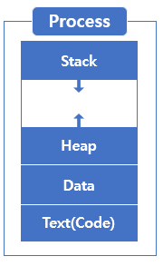
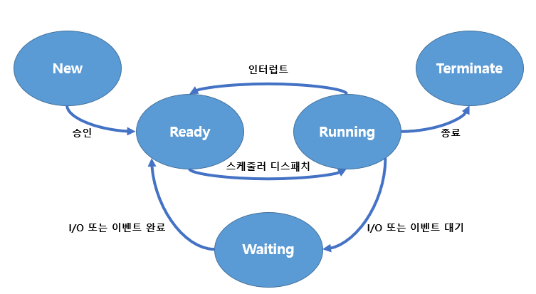
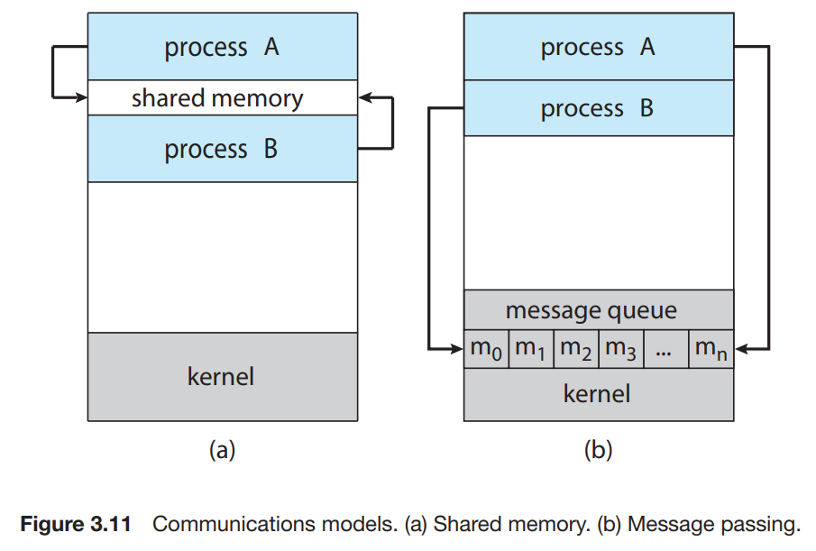
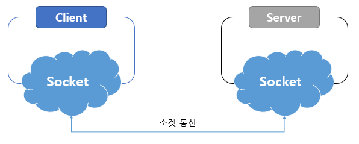
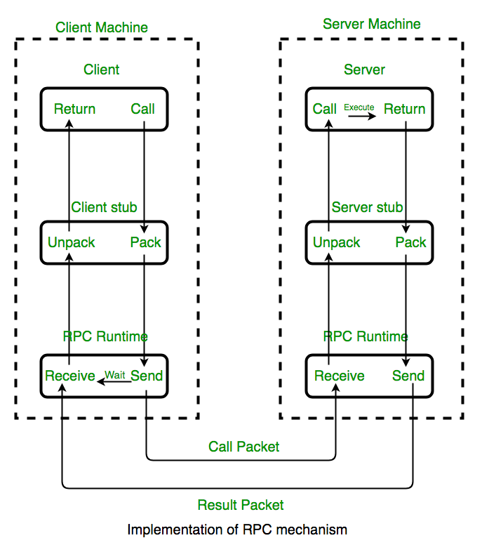

# CH03. 프로세스

# 프로세스

- 실행 중인 프로그램을 의미함
- 현대 컴퓨팅 시스템에서 작업의 단위
- 프로세스 활동 상태 - 프로그램 카운터, 프로세서 레지스터 내용으로 표현 가능
- 프로세스 메모리 배치 섹션
    
    
    
    - Text - 실행 코드
    - Data - 전역 변수
    - Heap - 동적 할당 메모리
    - Stack - 임시 데이터 저장소(함수 매개변수, 복귀 주소, 지역 변수)
- 스택/힙 섹션은 프로그램 실행 중 동적으로 줄어들거나 커질 수 있음
    - 스택
        - 함수가 호출될 때마다 함수 매개변수, 지역 변수, 복귀 주소를 포함하는 `활성화 레코드` 가 스택에 푸시
        - 함수에서 제어가 되돌아오면 `활성화 레코드` 를 팝하여 활용
    - 힙
        - 메모리가 동적으로 할당되면서 힙이 커지고 줄어듬
    - 서로의 방향으로 커지더라도 운영체제는 겹치지 않도록 해야 함

## Q. 프로그램 자체가 프로세스인가?

- 프로그램 - 명령어 리스트가 디스크에 저장되어 있는 수동적인 존재
- 프로세스 - 다음 실행 명령어를 지정하는 프로그램 카운터(PC)와 관련 자원을 가진 능동적 존재

## 프로세스 상태

- 프로세스 상태의 종류
    
    
    
    - New - 프로세스 생성
    - Running - 명령 실행 중
    - Waiting - 프로세스가 특정 이벤트(입출력 완료, 신호 수신, 인터럽트 등)를 기다리는 상태
    - Ready - 프로세스가 CPU에 할당되기를 기다리는 상태
    - Terminate - 프로세스 종료

## PCB(프로세스 제어 블록)

- CPU에 의해 실행 중인 특정한 프로세스 관리 정보를 포함
- 포함되어 있는 내용
    - 프로세스 상태 : new, ready, running, waiting, halted 등
    - 프로그램 카운터 : 다음에 실행할 명령어의 주소
    - CPU 레지스터 : 누산기, 인덱스 레지스터, 스택 레지스터, 범용 레지스터, 상태 코드 등
    - CPU 스케줄링 정보 : 프로세스 우선 순위, 스케줄 큐 포인터, 스케줄 매개변수
    - 메모리 관리 정보 : base 레지스터와 limit 레지스터의 값, 페이지 테이블, 세그먼트 테이블 등
    - Accounting 정보 : CPU 사용 시간, 현재시간, 타임아웃, 계정 정보, 프로세스 번호 등 포함
    - 입출력 상태 정보 : 프로세스에 할당된 입출력 장치, 열린 파일의 목록 등
- PC와 레지스터들은 인터럽트 발생 시 복구를 위해 저장되어야 함

## 스레드

- 프로세스의 실행 흐름
- 여러 스레드가 병렬로 실행될 수 있음

# 프로세스 스케줄링

- 목적 : CPU 이용의 최대화
- 프로세스 스케줄러 - 실행 가능한 여러 프로세스 중 하나의 프로세스 선택
- I/O 바운드 프로세스 - I/O에 많은 시간을 소비하는 프로세스
- CPU 바운드 프로세스 - 계산에 많은 시간을 소비하는 프로세스

## 스케줄링 큐

- 프로세스 실행 → 준비 큐에 들어가서 준비 상태
- 이벤트가 발생하기를 기다리는 프로세스 → 대기 큐에 삽입
- 대기 큐의 프로세스가 대기 상태에서 준비 상태로 젼환되면서 준비 큐로 이동(I/O, 자식 프로세스 실행)
- 종료 시점에 PCB 및 자원 반환

## CPU 스케줄링

- CPU 스케줄러의 역할은 준비 큐의 프로세스 중 하나의 프로세스에 코어를 할당하는 것
- 대부분 새 프로세스를 자주 선택하고, 실행 프로세스를 자주 변경하는 방식으로 구현
- 스와핑
    - 메모리에서 프로세스를 제거하여 멀티프로그래밍 수준 감소
    - 프로세스를 메모리에서 디스크로 swap out 하여 현재 상태 저장,
    이후 필요할 때 디스크에서 메모리로 swap in 하여 상태 복원
    - 메모리가 초과되어 가용 공간을 확보해야 할 때 사용

## Context Switching

- 인터럽트 처리 시 Context를 복구할 수 있도록 현재 실행 중인 상태를 저장해야 함
- Context → 프로세스의 PCB에 표현
- 코어를 다른 프로세스로 교환할 때, 이전 프로세스 상태를 보관하고 새로운 프로세스의 보관된 상태를 복구하는 작업이 수행된다 - 이를 Context Switching이라고 함
- Context Switching 시간 → 결국 오버헤드
시간을 적절히 설정할 필요가 있음

# 프로세스 실행 과정

## 프로세스 생성

- 프로세스들이 새로운 프로세스 생성 가능
- 생성하는 프로세스 → 부모 프로세스, 생성되는 프로세스 → 자식 프로세스
프로세스 트리 구성
- pid를 이용하여 프로세스 구분(Linux의 경우 systemd가 항상 pid 1)
- 새로운 프로세스를 실행시키는 방법
    - 부모가 자식과 병렬로 실행을 계속한다
    - 부모는 자식이 실행을 종료할 때까지 기다린다
- 주소 공간 측면의 방법
    - 자식 프로세스는 부모 프로세스의 복사본이다
    - 자식 프로세스가 자신에게 적재될 새로운 프로그램을 갖고 있다
- fork() 사용 시
    - 부모 프로세스 : 리턴 값이 자식 프로세스의 PID
    - 자식 프로세스 : 리턴 값이 0
    - 자식 프로세스는 열린 파일과 같은 자원, 권한, 스케줄링 속성을 부모 프로세스로부터 상속
- exec() 사용 시
    - 특정 바이너리 파일을 메모리로 적재하고, 기존 프로그램을 파괴
    - 포크 이후 사용하면 부모와 통신 가능한 다른 프로그램이 생성되는 것으로 볼 수 있음

## 프로세스 종료

- 부모가 자식을 종료시키기 위해서는 자식의 pid를 알아야 함 → fork() 리턴값이 자식 pid
- 자식이 종료되는 상황
    - 자식이 할당된 자원을 초과하여 사용할 때(부모가 자식의 상태 확인 가능해야 함)
    - 할당된 태스크가 더이상 필요 없을 때
    - 부모가 exit하는데, 운영체제에서 부모 없는 자식을 허용하지 않는 경우
- wait 호출을 통해 자식의 종료 상태를 확인 가능
- 종료되엇지만 부모 프로세스가 아직 wait를 호출하지 않은 상태를 좀비 프로세스라고 함
    - 좀비 프로세스의 경우 wait을 호출하면 프로세스 자원이 운영체제에 반환
- 부모 프로세스가 wait를 호출하지 않고 종료한 상태를 고아 프로세스라고 함
    - Unix에서는 고아 프로세스의 부모를 init으로 설정하여 이를 해결
    - 주기적으로 wait을 호출
    - Linux에서는 systemd 말고 다른 프로세스가 처리하는 경우도 있음
        - 일부 데몬 프로세스에서 고아 처리기로 지정
        [https://man7.org/linux/man-pages/man2/prctl.2.html#DESCRIPTION](https://man7.org/linux/man-pages/man2/prctl.2.html#DESCRIPTION)
        **`PR_SET_CHILD_SUBREAPER`** (arg1) 으로 설정
        - 조상 중 고아 처리기가 있으면 해당 고아 처리기가 수행, 없는 경우 PID가 1인 systemd가 수행

# 프로세스 간 통신

- 협력적 프로세스는 데이터를 교환할 수 있는 통신 기법 필요
- 이를 IPC라고 함
    - 공유 메모리 모델 - 공유 메모리 영역 구축에만 시스템 콜 필요, 구축 후 커널의 도움 x
    - 메시지 전달 모델 - 충돌 회피 필요없음, 적은 양의 데이터 교환에 유용, 구현하기 쉬움

출처 : Operating System Concept(공룡책)

## IPC - 공유 메모리

- 공유 메모리 세그먼트를 생성하는 프로세스 공간에 위치
- 일반적으로 다른 프로세스의 메모리에 접근하는 것을 금지하지만, 공유 메모리는 그 예외
- 공유 영역에 읽고 씀으로써 정보 교환, 운영체제의 소관을 벗어남

### 생산자 - 소비자 문제

- 생산자는 정보를 생산
- 소비자는 정보를 소비
- 이 문제를 공유 메모리를 통해 해결 가능 - 생산자가 정보를 채워 넣고 소비자가 정보를 소비
- 생산자가 한 항목을 생산하는 동안 소비자는 다른 항목을 소비할 수 있음
- 유한 버퍼와 무한 버퍼 존재

## IPC - 메시지 전달 시스템

- 운영체제의 메시지 전달 설비를 사용
- 최소한 두가지 연산 제공
    - send(msg)
    - receive(msg)
- 통신 구현 방법
    - 직/간접 기준
        - 직접 통신
            - 대칭성 있는 통신, 두 프로세스 사이에만 연관됨
            - 프로세스 쌍 사이 정확히 하나의 연결만 존재해야 함
        - 간접 통신
            - 메일박스, 포트로 송신되고 거기서 수신
            - 생산 프로세스들에 의해 메시지들이 들어가고, 소비 프로세스들이 소비
            - 다수의 메일박스 활용 가능
    - 동기화 기준
        - blocking
            - 송신 - 수신 프로세스나 메일박스에 의해 수신될 때까지 blocking
            - 수신 - 메시지가 이용 가능할 때까지 blocking
        - nonblocking
            - 송신 - 메시지를 보내고 작업 재개
            - 수신 - 유효한 메시지 또는 Null을 전달받음
    - 버퍼(임시 큐) 기준
        - zero capacity - 큐의 길이가 0, 자체 대기 메시지 없음
        - bounded capacity - 최대 n개의 메시지까지 들어있을 수 있음
        - unbounded capacity - 무한한 길이의 큐 존재

# IPC 시스템 예시

## 공유 메모리

- 메모리 - 사상 파일을 이용하여 메모리 특정 영역을 파일과 연관시킴
- 공유 메모리 객체가 생성되면 ftruncate()를 이용해 크기를 바이트 단위로 설정
- mmap()을 이용하여 공유 메모리 객체를 포함하는 메모리-사상 파일 구축

## Mach 메시지 전달

- Mach 운영체제(커널)에서 사용되는 방식
- 포트라는 형태의 메일박스를 통해 메시지를 주고받음

## Windows 메시지 전달 설비

- Windows 운영체제에서 사용되는 방식
- ALPC라고 불림
- 연결 포트와 통신 포트라는 두 가지 유형의 포트 사용

## Pipe

- 두 프로세스가 통신할 수 있게 하는 전달자
- 고전 UNIX의 IPC 기법 중 하나, 프로세스 간 통신하는 간단한 방법

### 일반(익명) Pipe

- 생산자 - 소비자 형태로 두 프로세스 간 통신 허용
- 단방향 통신만을 가능하게 하며, 양방향이 필요하면 두 개의 파이프 사용
- 파이프를 생성한 프로세스 외에는 접근할 수 없기 때문에, fork()로 생성한 자식 프로세스와 통신하기 위해 사용된다.(열린 파일을 부모로부터 상속받기 때문)

### Named Pipe

- 양방향 가능, 부모-자식 관계 필요 x
- 이름만 알면 여러 프로세스들이 이를 사용하여 통신 가능
- Unix에서는 FIFO라고 부름
- 양방향이 가능하긴 하지만, 반이중 전송만 가능하기 때문에 일반적으로 2개의 FIFO가 사용됨

# 클라이언트 서버 환경 통신

## 소켓 통신

- 통신의 극점
- TCP, UDP 소켓 존재
- 스레드 간 구조화되지 않은 바이트 스트림만 통신
- 원시적인 바이트 스트림 데이터를 구조화하여 해석해야 함 - 클라이언트/서버의 책임

## RPCs(원격 프로시저 호출)

출처 : geeks for geeks

- IPC를 기반으로 한 원격 서비스 - 메시지 기반 통신 필요
- 시스템에서 지원되는 서비스를 구별하기 위해 여러 개의 포트를 가질 수 있음
- 적절한 포트 주소로 메시지를 전달해야 함
- 일종의 스텁을 제공하여 통신에 필요한 사항을 숨겨 준다
- 클라이언트는 일반 메소드를 호출하는 것처럼 원격 프로시저 호출이 가능하다