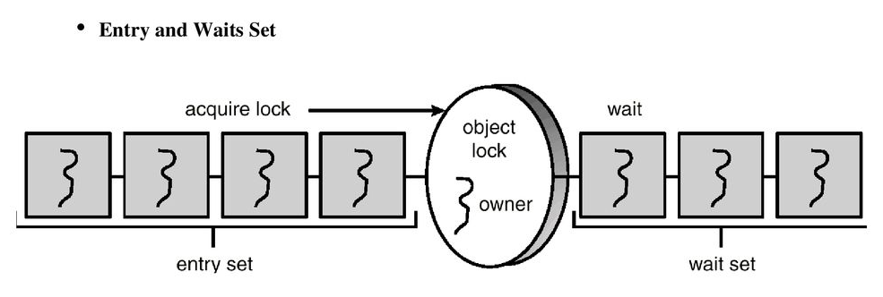

# CH07. 동기화 예제

# 고전적인 문제

## 유한 버퍼 문제

- n개의 버퍼로 구성된 풀이 있음
- 각 버퍼당 아이템 1개 저장 가능
- mutex를 이용하여 버퍼 풀에 접근 할 수 있으며, empty와 full 세마포어를 이용하여 빈 버퍼의 수, 꽉 찬 버퍼의 수를 기록한다.

## Reader-Writer Problem

- 하나의 writer와 다른 reader or writer가 동시에 접근하면 문제 발생
- writer가 쓰기 작업 동안 공유 데이터베이스에 대해 배타적 접근 권한을 갖게 할 필요가 있음

# Java

## JAVA에서의 쓰레드 생명 주기


출처 : GeeksforGeeks

- 총 6가지의 lifecycle이 존재한다.
- 다양하게 표현되어 있고, Running을 표현하는 경우도 있지만, 실제로 Java 구현체를 확인해 보면 위와 같은 형태로, Thread.State라는 enum 클래스 형태로 구현되어 있다.
    
    ```java
    public enum State {
            NEW,
            RUNNABLE,
            BLOCKED,
            WAITING,
            TIMED_WAITING,
            TERMINATED;
        }
    ```
    
    - NEW : 쓰레드가 처음 생성되고, 아직 시작되지 않은 상태
    - RUNNABLE : 실행 가능한 상태로, JVM 내에서는 실행 중이지만 프로세서와 같은 다른 리소스를 기다리고 있는 상태, 지속적으로 컨텍스트 스위칭이 일어날 수 있는 상태
    - BLOCKED : 모니터의 lock으로 인해 멈춰 있는 상태로, synchronized 상태의 블록이나 메소드에 진입하고자 할 때 다른 스레드들이 얻는 상태 → busy-waiting
    - WAITING : 대기 중인 스레드 상태로, 시간 초과가 존재하지 않는 wait()이나 join()을 활용하여 대기 중인 상태. notify()나 notifyAll()을 이용하여 깨워 줄 수 있음 → block-wakeup
    - TIMED_WAITING : 시간 제한이 존재하는 대기 상태로, sleep()이나 timeout이 존재하는 wait, join을 이용하여 대기 중인 상태
    - TERMINATED : 스레드의 실행이 완료된 상태

## Java에서의 동기화 방법

- 기본적으로 Java에서는 고수준의 Monitor와 같은 병행성 기법을 제공하고 있음

### synchronized 키워드

- 객체 중심의 언어인 Java에서는 모든 객체가 모니터를 갖고 있음 → synchronized 이용
    - synchronized method
        - 해당 메서드가 존재하는 객체 인스턴스와 연결된 락 방법
        - 다른 스레드가 락을 소유한 경우 해당 메소드를 호출한 스레드는 BlOCKED 상태가 되고, 객체의 락에 존재하는 entry set에 추가됨
        - 스레드가 메소드를 종료하면 해당 객체에 대한 락이 해제
        
        ```java
        public class SynchronizedCounter {
            private int c = 0;
        
            public synchronized void increment() {
                c++;
            }
        
            public synchronized void decrement() {
                c--;
            }
        
            public synchronized int value() {
                return c;
            }
        }
        // 출처 : oracle java docs
        ```
        
    - synchronized + wait + notify
        - 스레드가 락 문제가 아닌, 자원 등의 문제로 인해 대기해야 할수도 있음
        ex) 유한 버퍼에서 버퍼가 꽉 찬 경우
        → wait() 호출을 통해 락을 해제하고 조건이 충족될 때까지 기다림(WAITING 상태로 wait set에 추가)
        - 결론적으로 아래와 같은 그림 형태의 set으로 대기
        
        
        
        출처 : Operating System Concepts(공룡책)
        
        - 일반적인 synchronized 메소드 종료 시, 이탈 스레드는 객체에 대한 락을 해제함으로써 entry set의 스레드에게 소유권을 넘겨줌
        - 그러나 특정 스레드가 synchronized 메소드 내부에서 notify() 호출을 수행하면 다른 일이 발생
            1. wait set에서 스레드 선택
            2. 해당 스레드를 entry set으로 이동 후 RUNNABLE 상태로 변경
    - synchronized block
        - 락의 획득과 해제 시점 → lock scope
        - 메소드 단위로 사용하면 lock scope가 너무 커질 수 있음
        - 메소드 내의 특정 코드 블록만 동기화 가능
        - 동일하게 해당 객체에 대한 객체 락 소유권 필요
        
        ```java
        // 자신 객체에 대한 synchronized block
        public void addName(String name) {
            synchronized(this) {
                lastName = name;
                nameCount++;
            }
            nameList.add(name);
        }
        
        // 별도 객체에 대한 synchronized block 설정도 가능
        public class MsLunch {
            private long c1 = 0;
            private long c2 = 0;
            private Object lock1 = new Object();
            private Object lock2 = new Object();
        
            public void inc1() {
                synchronized(lock1) {
                    c1++;
                }
            }
        
            public void inc2() {
                synchronized(lock2) {
                    c2++;
                }
            }
        }
        
        // 출처 : oracle java docs
        ```
        

### volatile 키워드

- 읽기, 쓰기의 경우 기본적으로 atomic함(long, double형 제외)
(읽기+쓰기는 atomic한 행위 2회이므로 atomic하지 않음)
- volatile 키워드를 사용하면 long, double 형도 atomic하게 읽고 쓸 수 있음
    - long, double primitive 형은 64비트 형태이기 때문에, 32비트씩 나누어서 읽어들이기 때문
    - java의 volatile 키워드는 즉각적으로 메인 메모리에 쓰거나 읽어오는 것을 보장하고, 가시성을 보장하는 키워드
    - 한 쓰레드에서만 쓰기 작업, 다른 쓰레드는 읽기 작업만 할 때 안전성 보장
    - 두 쓰레드가 동시에 쓰기 작업에 들어간다면 동시성 문제가 발생할 수 있음

### High Level Concurrency Objects

- Reentrant Lock
    - 단일 스레드가 소유하며 공유 자원에 대한 상호 배탁적 액세스 제공
    - 공정성 매개변수 등의 추가 기능 제공 → 오래 기다린 스레드에 락 제공하는 기능
- Semaphore
    - 카운팅 세마포어 제공
    - acquire와 release를 통해 인터럽트를 방어함
    - 락을 획득하려는 스레드가 인터럽트 되는 경우 acquire() 메소드가 InterruptedException을 발생
- Condition Variable
    - wait(), notify()메소드와 유사한 기능을 제공
    - ReentrantLock과 연계하여 사용
    - await()과 signal() 메소드를 활용
    - wait(), notify()와 다른 점은 스레드 번호를 통해 어떤 스레드가 signal 신호를 받을지 지정할 수 있다는 점
- Atomic Variable
    - 원자성을 보장해 주는 변수
    - synchronized 키워드 없이 동기화 문제 해결
    - CAS 알고리즘 활용
    * CAS(Compare-And-Swap) :
    - 내부에 존재하는 여러 메소드들을 활용하여 원자성을 보장하는 연산을 수행할 수 있음
    - 동시에 쓰기 작업에 들어가는 경우에도 원자성을 보장
- Concurrent Collections
    - 스레드 동시성을 보장해 주는 컬렉션 객체
    - BlockingQueue, ConcurrentMap, ConcurrentNavigationMap 등의 다양한 동기화를 제공하는 Collections 객체들이 존재

참고문헌

[https://docs.oracle.com/javase/tutorial/essential/concurrency/index.html](https://docs.oracle.com/javase/tutorial/essential/concurrency/index.html)

[https://stackoverflow.com/questions/34387242/why-using-volatile-makes-long-and-double-atomic](https://stackoverflow.com/questions/34387242/why-using-volatile-makes-long-and-double-atomic)

[https://docs.oracle.com/javase/8/docs/api/java/util/concurrent](https://docs.oracle.com/javase/8/docs/api/java/util/concurrent)